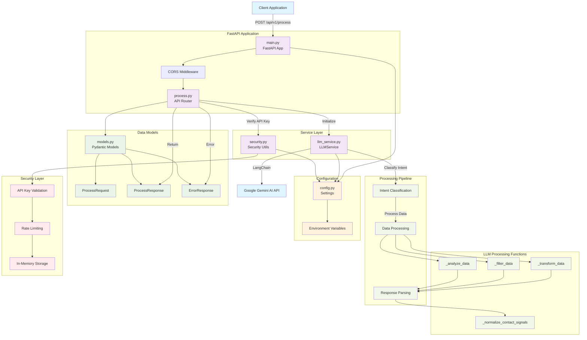

# Low-Level Design (LLD) Diagram - LLM Backend API

## System Architecture Overview

This is a FastAPI-based backend service that processes table data using Google's Gemini AI through LangChain. The system provides intelligent data transformation capabilities with API key authentication and rate limiting.

## Mermaid Diagram

## Component Details

### 1. **FastAPI Application Layer**
- **main.py**: Core FastAPI application with CORS middleware
- **process.py**: API router handling `/api/v1/process` endpoint
- **CORS Middleware**: Handles cross-origin requests

### 2. **Service Layer**
- **LLMService**: Main service for AI operations using LangChain
- **Security**: API key validation and rate limiting utilities

### 3. **Data Models (Pydantic)**
- **ProcessRequest**: Input model with user prompt and table data
- **ProcessResponse**: Output model with AI message and processed data
- **ErrorResponse**: Error handling model

### 4. **Configuration Management**
- **config.py**: Centralized settings management
- Environment variables for API keys, rate limits, and logging

### 5. **Processing Pipeline**
- **Intent Classification**: Determines user intent (currently only data_transformation)
- **Data Processing**: Applies appropriate processing function
- **Response Parsing**: Extracts and validates LLM responses

### 6. **LLM Processing Functions**
- **_transform_data**: Adds new fields based on user requests
- **_filter_data**: Filters data based on criteria
- **_analyze_data**: Performs data analysis
- **_normalize_contact_signals**: Normalizes data types

### 7. **Security Layer**
- **API Key Validation**: Simple validation for MVP
- **Rate Limiting**: Per-minute request limits (default: 100/min)
- **In-Memory Storage**: Temporary storage for rate limit tracking

## Key Features

1. **AI-Powered Data Processing**: Uses Google Gemini AI for intelligent data transformation
2. **Intent Classification**: Automatically determines user intent (currently focused on data transformation)
3. **API Security**: API key authentication with rate limiting
4. **Robust Error Handling**: Comprehensive error responses and logging
5. **Docker Support**: Containerized deployment with health checks
6. **Flexible Data Processing**: Supports filtering, transformation, and analysis operations

## API Endpoints

- `POST /api/v1/process`: Main data processing endpoint
- `GET /api/v1/health`: Health check endpoint
- `GET /`: Root endpoint with API status

## External Dependencies

- **Google Gemini AI**: For LLM processing via LangChain
- **FastAPI**: Web framework
- **Pydantic**: Data validation and serialization
- **Uvicorn**: ASGI server for production deployment
